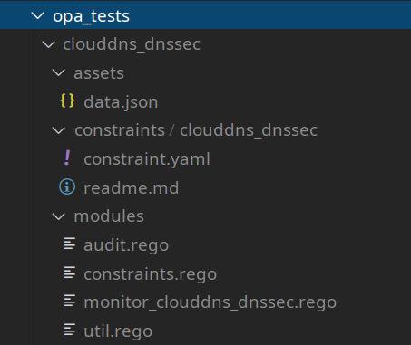

# Setup local REGO tests

How to test and troubleshoot locally REGO compliance rules and related YAML constraints.

- Check which version of OPA RAM uses from [`go.mod`](https://github.com/BrunoReboul/ram/blob/master/go.mod)
- Install the same version of OPA locally using [Running OPA documentation](https://www.openpolicyagent.org/docs/latest/#running-opa), and add it to the PATH
- Check OPA version using `opa version`
- In the root of the repo containing the rules, create `opa_tests` folder
  - This folder name as already been excluded in the `.gitignore`
- In `opa_tests`, create a subfloder for the rule to be tested, e.g. `your_test`
- In `your_test`, create 3 subfolders `assets`, `constraints`, `modules` (same structure as used by `monitor` cloud functions)
- In `modules`
  - Creates the following `.rego` files pasting REGO code from RAM repo file [`meth_instancedeployment_makezipspecifccontent.go`](https://github.com/BrunoReboul/ram/blob/master/services/monitor/meth_instancedeployment_makezipspecifccontent.go):
    - `audit.rego` paste code from constant `auditRego`
    - `constraint.rego` paste code from constant `constraintsRego`
    - `util.rego` paste code from constant `utilRego`
  - Paste the REGO rule file to test, e.g. `monitor_myrule.rego`
- in `constraints`
  - Paste the constraint folder to test, e.g. `myrule` containing the `constraint.yaml` file to test
- In `assets`
  - Create json file `data.json`
  - Initiate the json structure with an empty array `[]`
  - Copy paste json asset objects used to test as provided by `upload2gcs` in the GCS bucket named `assets-json`
  - Take care to add a comma `,` between objects to repect JSON syntax
- The folder structure should look like:

  
- From `opa_tests`Launch OPA specifying the rule subfolder as an argument, exemple `opa run clouddns_dnssec/`
- From OPA run use 3 following commands:

```opa
> package validator.gcp.lib
> notes
> audit
```

- the expected output contains 1) the note traces 2) the violation array, example

```opa
clouddns_dnssec/modules/audit.rego:22                       | Enter data.validator.gcp.lib.audit
clouddns_dnssec/modules/audit.rego:25                       | | Note "asset name: //dns.googleapis.com/projects/blabla/managedZones/77blabla02"
clouddns_dnssec/modules/audit.rego:31                       | | Note "constraint kind: GCPDNSSECConstraintV1"
clouddns_dnssec/modules/audit.rego:46                       | | Note "asset.ancestry_path: organization/16blabla36/folder/41blabla85/project/32blabla97"
clouddns_dnssec/modules/audit.rego:47                       | | Note "targets: [\"organization/\"]"
clouddns_dnssec/modules/audit.rego:48                       | | Note "is in scope:%!(EXTRA string=true)"
clouddns_dnssec/modules/audit.rego:60                       | | Note "exclusions: null"
clouddns_dnssec/modules/audit.rego:61                       | | Note "Excluded if count exclusion_match > 0: 0"
clouddns_dnssec/modules/monitor_clouddns_dnssec.rego:19     | | Enter data.templates.gcp.GCPDNSSECConstraintV1.deny
clouddns_dnssec/modules/monitor_clouddns_dnssec.rego:28     | | | Note "state: ON"
clouddns_dnssec/modules/audit.rego:25                       | | Note "asset name: //dns.googleapis.com/projects/blabla/managedZones/82blabla66"
clouddns_dnssec/modules/audit.rego:31                       | | Note "constraint kind: GCPDNSSECConstraintV1"
clouddns_dnssec/modules/audit.rego:46                       | | Note "asset.ancestry_path: organization/16blabla36/folder/13blabla66/project/83blabla16"
clouddns_dnssec/modules/audit.rego:47                       | | Note "targets: [\"organization/\"]"
clouddns_dnssec/modules/audit.rego:48                       | | Note "is in scope:%!(EXTRA string=true)"
clouddns_dnssec/modules/audit.rego:60                       | | Note "exclusions: null"
clouddns_dnssec/modules/audit.rego:61                       | | Note "Excluded if count exclusion_match > 0: 0"
clouddns_dnssec/modules/monitor_clouddns_dnssec.rego:19     | | Enter data.templates.gcp.GCPDNSSECConstraintV1.deny
clouddns_dnssec/modules/monitor_clouddns_dnssec.rego:28     | | | Note "state: OFF"
[
  {
    "asset": "//dns.googleapis.com/projects/blabla/managedZones/82blabla66",
    "constraint": "clouddns_dnssec",
    "constraint_config": {
      "apiVersion": "constraints.gatekeeper.sh/v1alpha1",
      "kind": "GCPDNSSECConstraintV1",
      "metadata": {
        "annotations": {
          "category": "Infrastructure Hardening",
          "description": "DNSSec must be enbled for all CloudDNS Zones."
        },
        "name": "clouddns_dnssec"
      },
      "spec": {
        "match": {
          "exclude": null,
          "target": [
            "organization/"
          ]
        },
        "severity": "major"
      }
    },
    "violation": {
      "details": {
        "resource": "//dns.googleapis.com/projects/blabla/managedZones/82blabla66"
      },
      "msg": "//dns.googleapis.com/projects/blabla/managedZones/82blabla66: DNSSEC is not enabled."
    }
  }
]
```

- `exit` to exit opa run
